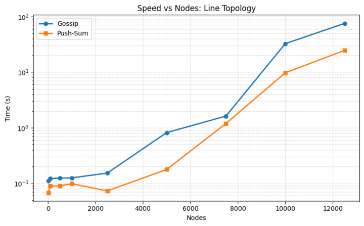
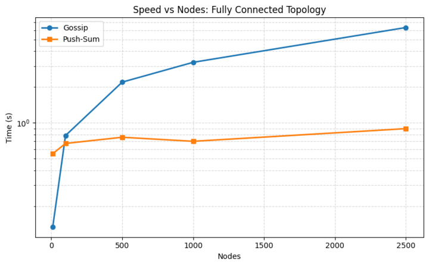
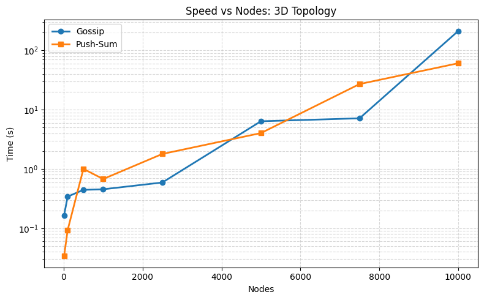
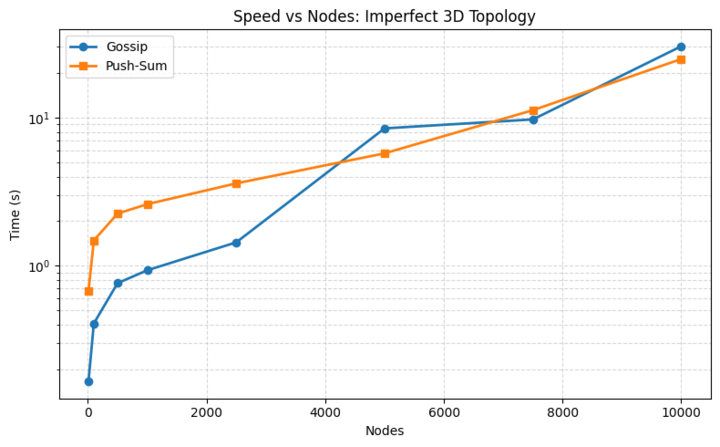

# Project 2 - Gossip Algorithm
## Team Members
Scott Slinn & Nick Costagliola

## What is Working
Examples: 
We believe that we have all four topologies and both algorithms working for each topology. Some of the timing was very inconsistent between computers as well as the size of the nodes causing imbalances based on memory available to be allocated to the program.

Most of our algorithms seemed to fail if we went over 12000 nodes, seemingly due to memory allocation issues with the amount of processes we were trying to create as actors. 

## Largest Networks that worked for each topology and algorithm:

Line:
  * Gossip: 12500
  * Push-Sum: 12500

Full:
  * Gossip: 2000
  * Push-Sum: 2000

3d:
  * Gossip: 10000
  * Push-Sum: 10000

Imperfect 3d:
  * Gossip: 10000
  * Push-Sum: 12500

